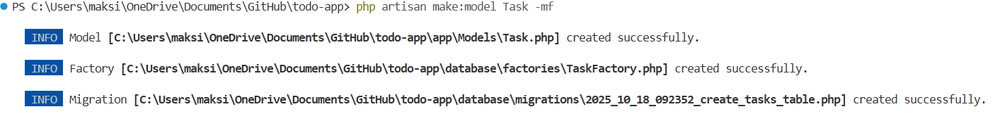
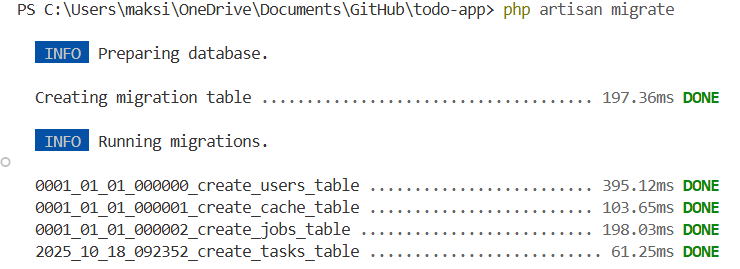
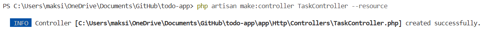
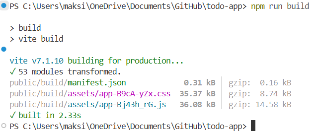

# Создание проекта todo-app на Laravel

### 1. **Установите `Laravel Installer` (опционально)**

```bash
composer global require laravel/installer
```

### 2. Создание нового проекта

```bash
# Создание проекта todo-app (laravel)
laravel new todo-app
# или
composer create-project laravel/laravel todo-app
```

**Перейдите в папку проекта:**

```bash
cd todo-app
```

### 3. Настройка базы данных

- Создайте базу данных (например, `todo_app`).
- **Отредактируйте .env файл:**

    ```bash
    # Создание базы данных для проекта todo-app (laravel)
    mysql -u root -p -e "CREATE DATABASE todo_app CHARACTER SET utf8mb4 COLLATE utf8mb4_unicode_ci;"
    ```

### 4. **Отредактируйте .env файл:**

```text
DB_CONNECTION=mysql
DB_HOST=127.0.0.1
DB_PORT=3306
DB_DATABASE=todo_app
DB_USERNAME=your_user
DB_PASSWORD=your_password
```

### 5. Создание модели и миграции для задач

```bash
php artisan make:model Task -mf
```



- Флаг `-m` создаёт миграцию, `-f` — фабрику (*опционально*).
- **В файле миграции (`database/migrations/..._create_tasks_table.php`) определите поля:**

    ```bash
    Schema::create('tasks', function (Blueprint $table) {
        $table->id();
        $table->foreignId('user_id')->constrained()->onDelete('cascade');
        $table->string('title');
        $table->text('description')->nullable();
        $table->boolean('completed')->default(false);
        $table->integer('order')->default(0);
        $table->timestamps();
    });
    ```

**Запустите миграцию:**
    ```bash
    php artisan migrate
    ```



### 6. Создание контроллера

```bash
php artisan make:controller TaskController --resource
```



**Реализуйте основные методы:**

- `index()` — отображение списка задач
- `store()` — добавление новой задачи
- `update()` — отметка как выполненной
- `destroy()` — удаление задачи

**Пример store():**

```bash
public function store(Request $request)
{
    $validated = $request->validate(['title' => 'required|string|max:255']);
    Task::create($validated);
    return redirect()->back();
}
```

### 7. Настройка маршрутов

**В `routes/web.php`:**

```php
use App\Http\Controllers\TaskController;

Route::resource('tasks', TaskController::class)->except(['show', 'edit', 'create']);
```

**Или вручную:**

```php
Route::get('/tasks', [TaskController::class, 'index'])->name('tasks.index');
Route::post('/tasks', [TaskController::class, 'store'])->name('tasks.store');
Route::patch('/tasks/{task}', [TaskController::class, 'update'])->name('tasks.update');
Route::delete('/tasks/{task}', [TaskController::class, 'destroy'])->name('tasks.destroy');
```

### 8. Создание представления (`Blade`)

**Создайте файл `resources/views/tasks/index.blade.php`:**

- Форма для добавления задачи (`POST` на `/tasks`)
- Список задач с чекбоксами (`PATCH` на `/tasks/{id}`)
- Кнопки удаления (`DELETE` на `/tasks/{id}`)

**Подключите CSRF-токены и используйте метод `spoofing` для `PATCH/DELETE`:**

```blade
<form method="POST" action="{{ route('tasks.update', $task) }}">
    @csrf
    @method('PATCH')
    <!-- чекбокс -->
</form>
```

### 🔧 Что нужно для корректной работы

- **_Маршруты должны быть определены с именами:_**
    ```php
    // routes/web.php
    use App\Http\Controllers\TaskController;

    Route::get('/tasks', [TaskController::class, 'index'])->name('tasks.index');
    Route::post('/tasks', [TaskController::class, 'store'])->name('tasks.store');
    Route::patch('/tasks/{task}', [TaskController::class, 'update'])->name('tasks.update');
    Route::delete('/tasks/{task}', [TaskController::class, 'destroy'])->name('tasks.destroy');
    Route::post('/tasks/reorder', [TaskController::class, 'reorder'])->name('tasks.reorder');
    ```

- **_Контроллер должен передавать `$tasks` в представление:_**

    ```php
    // TaskController.php
    public function index(Request $request)
    {
        $filter = $request->query('filter', 'all');
        
        $query = $request->user()->tasks()->orderBy('order');
        
        switch ($filter) {
            case 'completed':
                $query->where('completed', true);
                break;
            case 'pending':
                $query->where('completed', false);
                break;
        }
        
        $tasks = $query->get(['id', 'title', 'description', 'completed', 'order', 'created_at']);

        return view('tasks.index', compact('tasks', 'filter'));
    }
    ```

- **_`Tailwind CSS` должен быть установлен и собран:_**

    ```bash
    npm install
    npm run build
    # или для разработки в реальном времени:
    npm run dev
    ```



### Проверка установки и настройки перед запуском проекта

✅ 1. Убедитесь, что зависимости установлены

```bash
composer install
npm install
```

> composer install — устанавливает PHP-зависимости (Laravel и пакеты).
> npm install — устанавливает фронтенд-зависимости (Tailwind CSS, Alpine.js и т.д.).

✅ 2. Соберите фронтенд-ресурсы (CSS/JS)

**Если вы используете Tailwind (как в примере index.blade.php), соберите стили:**

```bash
npm run build
```

✅ 3. Сгенерировать ключ приложения

```bash
php artisan key:generate
```

✅ 4. Выполните миграции базы данных

```bash
php artisan migrate
```

> Это создаст таблицу `tasks` в вашей БД. Убедитесь, что БД существует и настройки в `.env` верны. 

### Запустите встроенный сервер разработки Laravel

```bash
php artisan serve
```

**Вы увидите сообщение вроде:**

```bash
Starting Laravel development server: http://127.0.0.1:8000
```

### 💡 Дополнительные рекомендации (опционально)

- **Использовать `Form Request` для валидации (если логика усложнится):**

```bash
php artisan make:request UpdateTaskRequest
```

- **Добавить политики (`Policies`) для более гибкой авторизации:**

```bash
php artisan make:policy TaskPolicy --model=Task
```

- **Обработка ошибок на фронтенде:** убедитесь, что ваш `JavaScript` проверяет response.success и обрабатывает 403 ошибки.

---

### Запуск проекта

- **Установите зависимости:**

```bash
composer install && npm install && npm run build
```

- **Настройте `.env` и выполните:**

```bash
php artisan key:generate
php artisan migrate
```

- **Запустите сервер:**

```bash
php artisan serve
```

> Перейдите на `http://127.0.0.1:8000`, зарегистрируйтесь и пользуйтесь TO-DO листом ...

---

### 📄 Лицензия

[Этот проект лицензирован под лицензией MIT](LICENCE)

Для получения дополнительной информации ознакомьтесь с файлом `LICENSE`

---

💼 **Автор:** Дуплей Максим Игоревич

📲 **Telegram №1:** [@quadd4rv1n7](https://t.me/quadd4rv1n7)

📲 **Telegram №2:** [@dupley_maxim_1999](https://t.me/dupley_maxim_1999)

📅 **Дата:** 18.10.2024

▶️ **Версия 1.0**

```textline
※ Предложения по сотрудничеству можете присылать на почту ※
📧 maksimqwe42@mail.ru
```